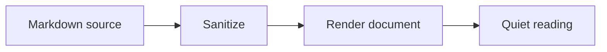
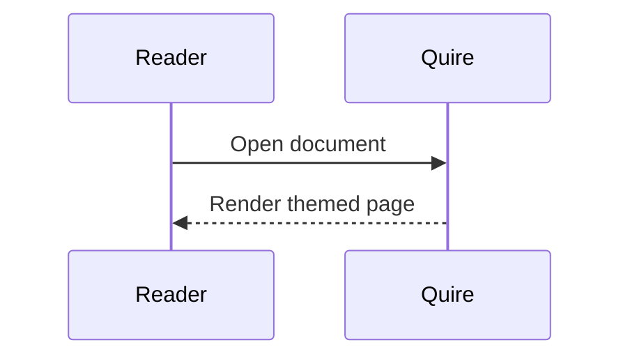
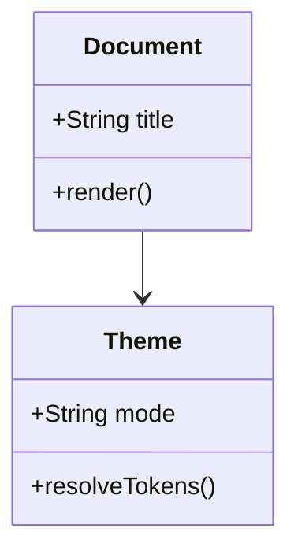
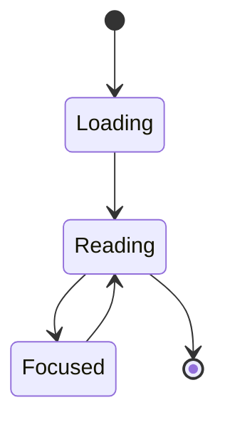
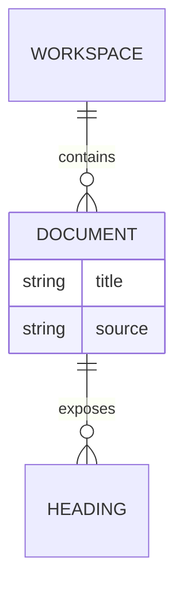
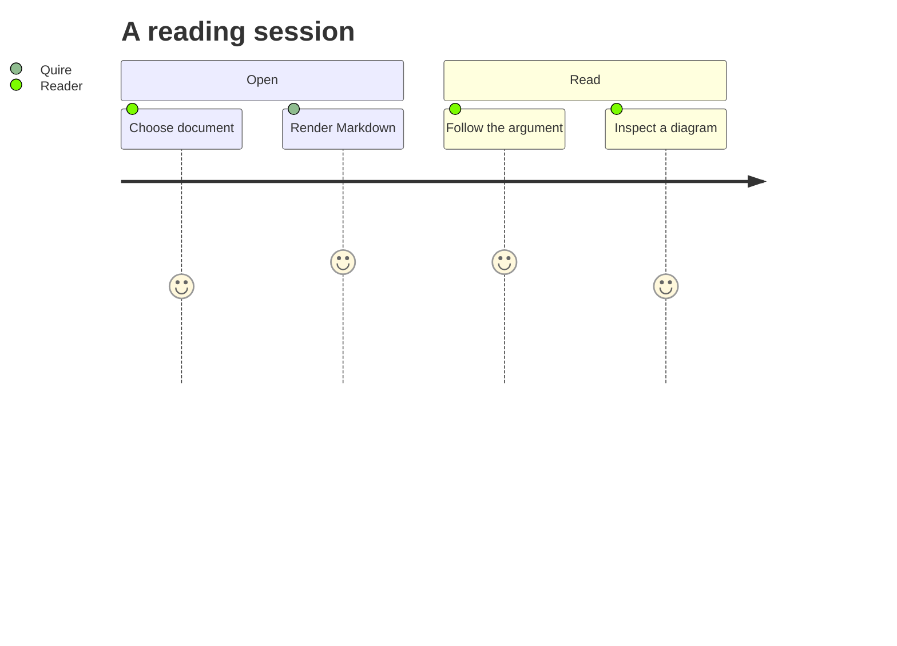
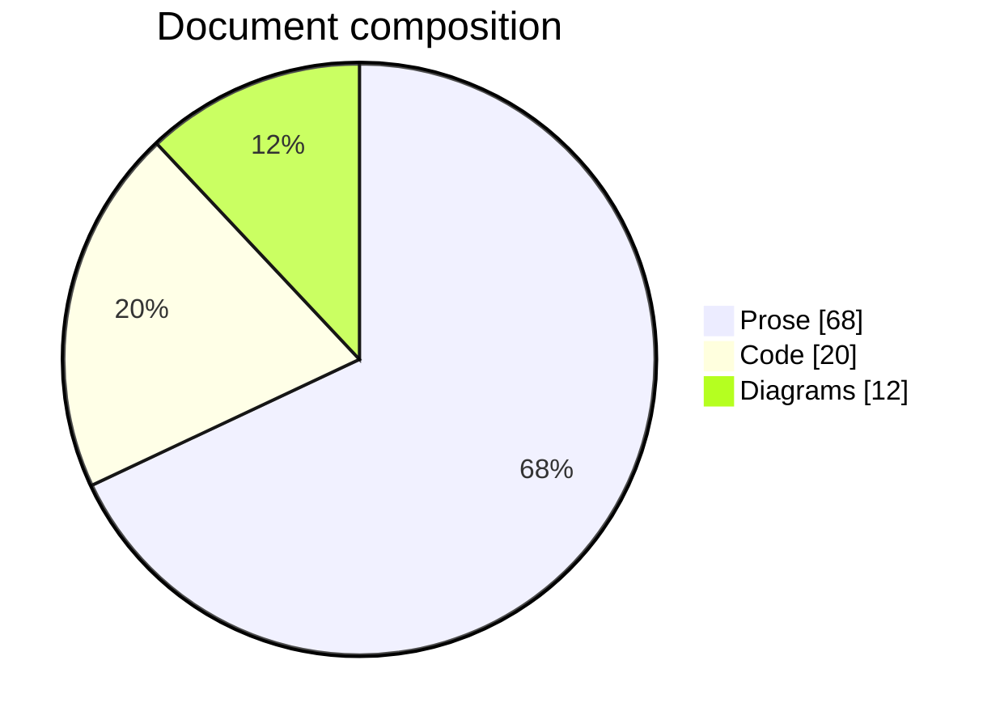
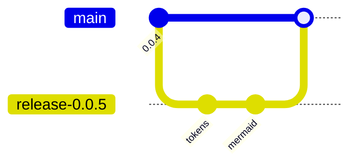
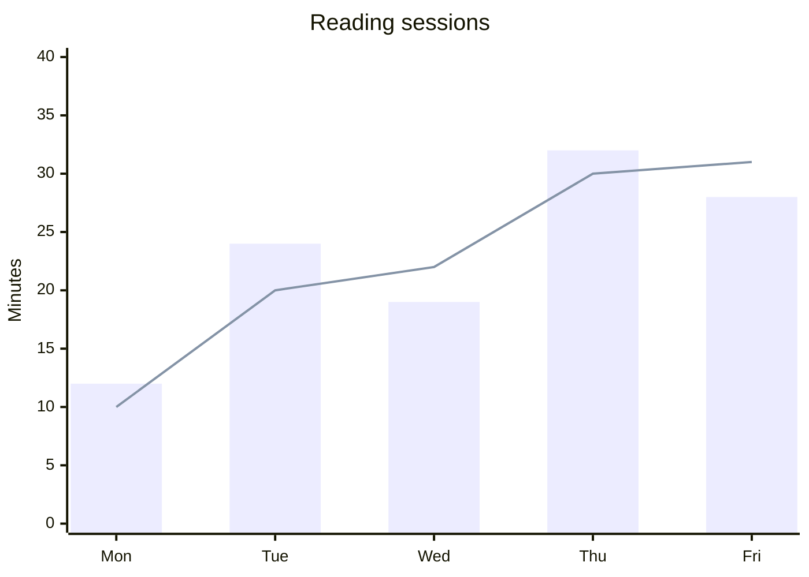

# Quire Visual System v2

A warm, quiet, high-contrast reading surface for long-form Markdown. This gallery is the visual acceptance fixture for typography, components, diagrams, and responsive behavior.

## Typography scale

### Heading level three

#### Heading level four

##### Heading level five

###### Heading level six

Body copy should feel calm at reading distance. It includes **strong text**, *emphasis*, ~~strikethrough~~, an [external link](https://example.com), and `inline code` that remains distinct without overpowering the sentence.

Quire separates reading content from application chrome. Secondary information remains legible, while the document title and primary prose keep the strongest contrast.

## Lists and tasks

- Unordered list marker uses a quiet tertiary tone.
- Nested content stays aligned.
  - A nested item
  - Another nested item with **emphasis**
- The final list item closes the rhythm.

1. Open a Markdown document.
2. Read without visual noise.
3. Use the workspace only when it helps.

- [x] Semantic tokens
- [x] Theme-aware Mermaid
- [ ] Final release review

## Quotes and callouts

> A reader should feel like a well-made page: present enough to guide you, quiet enough to disappear.

::: note
**Note.** Quire keeps useful context close to the document without turning the reading surface into a dashboard.
:::

::: warning
**Warning.** Long tables, code blocks, and diagrams must remain usable at narrow viewport widths.
:::

## Table

| Token family | Purpose | Example |
| --- | --- | --- |
| Surface | Separates document, toolbar, sidebar, and elevation | `--surface-document` |
| Text | Establishes strong, primary, secondary, and tertiary hierarchy | `--text-secondary` |
| Interaction | Describes hover, active, selected, and focus states | `--focus-ring` |
| Semantic | Communicates success, warning, danger, and highlight | `--warning-soft` |

## Code

### JavaScript

```js
const reader = await Quire.open('guide.md');
reader.focus();
```

### TypeScript

```ts
type ReaderTheme = 'light' | 'dark';

interface ReadingSession {
  documentId: string;
  theme: ReaderTheme;
}
```

### Go

```go
package main

func main() {
	fmt.Println("quiet reading")
}
```

### JSON

```json
{
  "theme": "system",
  "contentWidth": 760,
  "enableMermaid": true
}
```

### Shell

```sh
pnpm compile
pnpm test
pnpm build
```

## Mathematics

Inline mathematics such as $E = mc^2$ should align naturally with prose.

$$
\int_{-\infty}^{\infty} e^{-x^2}\,dx = \sqrt{\pi}
$$

## Image


## Mermaid flowchart



## Mermaid sequence



## Mermaid class



## Mermaid state



## Mermaid entity relationship



## Mermaid journey



## Mermaid pie



## Mermaid git graph



## Mermaid XY chart



## Closing rhythm

The final section verifies the spacing that separates a long document from its footer. Every surface should remain warm, every text hierarchy should remain explicit, and every interaction should retain a visible focus state.
